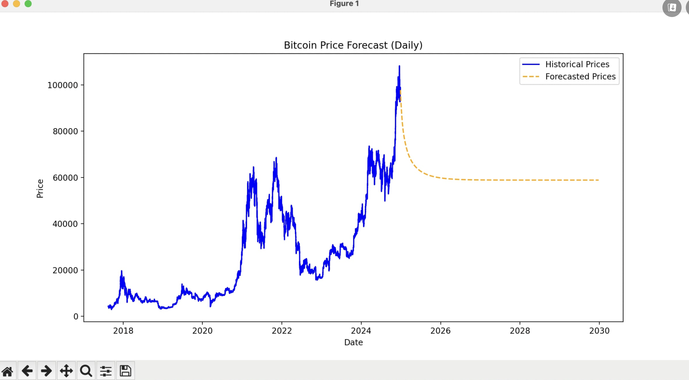

# AntiPine Course Project

> `marp README.md` - generates presentation

## How to run FE

1. `npm install` - installs all dependencies
2. `npm run dev` - runs the project locally
3. \* `npm run build && npm run start` - build the project and starts it
4. open `localhost:3000`

## How to run BE

1. `source .venv/bin/activate` - activate python env
2. `python -m flask --app api run` - runs the BE API
3. `python -m pip install {package}` - installs new package in the python env
4. open `localhost:5000`

## Folder structure

. \
├─ /public - images/files \
├─ /client - Front-end code \
├─ /python - Back-end code

## Client Portal

For the FE we have used React.js + Next.js

- [react js](https://react.dev/)
- [next js](https://nextjs.org/docs)

### History page

On this page you can see the whole historical data used for the predictions for the specific stock. You can change the stock from the navigation above the chart.


### Prediction page

On this page you can see the predicted data for the next 5 years for the stock you have selected. You have the option to select different stock from the navigation above the chart. You can also change the time period for which you want to see the predicted data ( up to 5 years). Since stock market prediction is hard thing there are multiple available predictions you can choose from and see what are the possibilities.


## Backend API

For the backend we have used Python 3 + Flask API

- [python](https://docs.python.org/3/)
- [flask api](https://flask.palletsprojects.com/en/stable/)

### GET /btc/prediction

This endpoint is used to get the predicted data for the bitcoin stock. The predicted data is generated with monte carlo simulations and it returns 5 possible outcomes.

```json
// The response is matrix
[
    [110, 121, 131, 90, 60],
    [121, 131, 141, 150, 66],
    [141, 120, 155, 131, 90],
    [99], 132, 189, 150, 161],
    ....
    [70, 131, 220, 170, 120]
]
```

### GET /btc/history

This endpoint is used to get the historical data which is used for the predictions of bitcoin. We are not returning all the fields just the Close price and the Date.

```json
{
  "Close": {
    "0": 110,
    "1": 120,
    "2": 130,
    "3": 111,
    "4": 121
  },
  "Date": {
    "0": "2024-01-01",
    "1": "2024-02-01",
    "2": "2024-03-01",
    "3": "2024-04-01",
    "4": "2024-05-01"
  }
}
```

### GET /sp500/prediction

This endpoint is used to get the predicted data for the s&p500 stock. The predicted data is generated with monte carlo simulations and it returns 5 possible outcomes.

```python
// The response is matrix
[
    [110, 121, 131, 90, 60],
    [121, 131, 141, 150, 66],
    [141, 120, 155, 131, 90],
    [99], 132, 189, 150, 161],
    ....
    [70, 131, 220, 170, 120]
]
```

### GET /sp500/history

This endpoint is used to get the historical data which is used for the predictions of bitcoin. We are not returning all the fields just the Close price and the Date.

```json
{
  "Close": {
    "0": 110,
    "1": 120,
    "2": 130,
    "3": 111,
    "4": 121
  },
  "Date": {
    "0": "2024-01-01",
    "1": "2024-02-01",
    "2": "2024-03-01",
    "3": "2024-04-01",
    "4": "2024-05-01"
  }
}
```

## Investigation

From our investigation we found that the possible ways to predict future stock market is by mathematical formulas, ML models or AI. This is a hard task because the stock market is very volatile and depends or a lot of factors that can change constantly. Because of that it's really hard to find accurate approach. The ML and AI approaches are slow and expensive and depends on a lot of data in order to predict years in the future. Most ML models were able to predict several months in the future with the datasets we had - we tried LSTM and ARIMA. For the mathematical approach we decided to try monte carlo simulation which is used to predict a lot of possible outcomes from uncertain events like the stock market.

### Monte Carlo Simulations

Although not perfect for day to day trading this approach gives as possible MIN and MAX ranges for the futures and we can crate a lot of simulations fast and cheap


### LSTM

Both LSTM and ARIMA models we good for this task but they need a lot of data in order to train the models, which we didn't have. With our data we could only predict several months in the future, but those models can be used effectively for day to day training in order to understand if tomorrow the stock price will be lower or higher



### ARIMA


### Link for the data we used

- [bitcoin dataset](https://www.kaggle.com/datasets/zackyzac/bitcoin-dataset-hourly/data?select=btc_data_hourly.csv)
- [s&p500 dataset](https://www.kaggle.com/datasets/henryhan117/sp-500-historical-data)
- [ML video](https://www.youtube.com/watch?v=QIUxPv5PJOY&ab_channel=ComputerScience%28compsci112358%29)
- [monte carlo video](https://www.youtube.com/watch?v=lJLiQGOopVE&ab_channel=ComputerScience%28compsci112358%29)

## Where to expand on

### Machine Learning

If we can get bigger dataset we can train some ML model to predict future stock prices based on different parameters. Some popular ML models are:

- ARIMA
- SARIMA
- VAR
- GARCH
- Random Forests
- LSTM
- GRU
- CNN

### AI Wrapper

We can implement wrapper around some AI model from Open AI and get the predictions directly from it in csv or json format, and cache the result in database.

- [open ai](https://platform.openai.com/docs/api-reference/introduction)

### Database

We can implement database to cache the result from the ML models or AI result to speed up the process and return the predictions immediately - sqlite, redis, memcache

- [sqlite](https://www.sqlite.org/)
- [redit](https://redis.io/)
- [memcache](https://docs.memcached.org/)

### Connect multiple stocks with external API

We can make the application generic and work for multiple stocks and crypto currencies. There are a lot of external APIs like yahoo, coin gecko, xignite, kaggle from which you can get full historical data.

- [yahoo finance api](https://developer.yahoo.com/api/)
- [coin gecko](https://www.coingecko.com/en/api)
- [xignite](https://www.xignite.com/financial-data-apis/)
- [kaggle](https://www.kaggle.com/docs/api)
